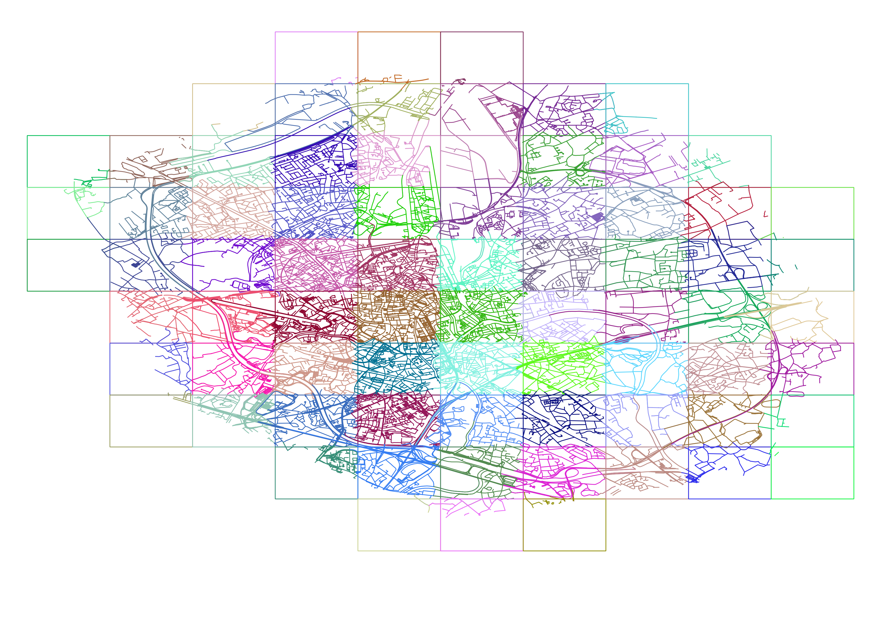

# routing2
 
  
  

The new for the v2 routing core. This is part of the work done by the awesome [open planner team](https://openplanner.team/).

## Goals of this project 

To consume routable tiles and make Itinero more flexible. Itinero should be able to update data in the routing graph and be able to handle more dynamic scenarios. Itinero should be able to do route planning using live OSM changes.

## Status

- [x] Build a basic data structures in tiled form.
  - [x] Get this done for vertices.
  - [x] Get this done for edges.
  - [x] Add support for turn-restrictions.
  - [x] Load tiles on demand.
- [x] Experiment with routing algorithms on top of this.
- [x] Build a proper resolving algorithm and verify performance.

## Map Matching

The `Itinero.MapMatching` package implements Hidden Markov Model (HMM) based map matching using a probabilistic model to snap GPS traces to the road network. The approach finds the most likely sequence of road segments for a given GPS track by solving a shortest-path problem on a layered factor graph using Dijkstra's algorithm (equivalent to the Viterbi algorithm on the HMM).

### References

The implementation is based on the following paper:

- **Newson, P. & Krumm, J. (2009).** *Hidden Markov Map Matching Through Noise and Sparseness.* Proceedings of the 17th ACM SIGSPATIAL International Conference on Advances in Geographic Information Systems. https://doi.org/10.1145/1653771.1653818

### Open-source projects

The parameter tuning, filtering strategies, and overall design were informed by these open-source map matching implementations:

- **[GraphHopper](https://github.com/graphhopper/graphhopper)** (Java, Apache-2.0) — The `map_matching` module implements Newson & Krumm with Viterbi decoding. GraphHopper's approach to candidate search, sigma_z tuning, and beta parameter selection informed our defaults.

- **[Valhalla](https://github.com/valhalla/valhalla)** (C++, MIT) — Valhalla's `meili` map matching engine provided reference values for close-point filtering (MinPointDistance), breakage distance thresholds, and transition cost parameters.

- **[OSRM](https://github.com/Project-OSRM/osrm-backend)** (C++, BSD-2-Clause) — The OSRM matching plugin's handling of GPS noise parameters and search radius selection served as an additional reference point for emission probability calibration.

## Development

**This repo uses submodules**. After cloning, run `git submodule init && git submodule update` to get all the dependencies. The OSM-ontology is saved in a submodule.
